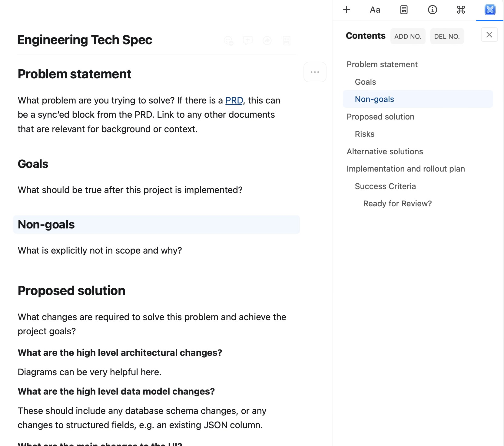
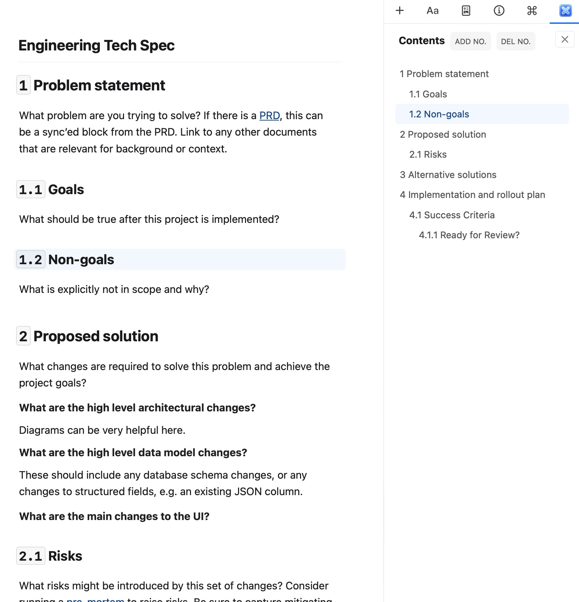
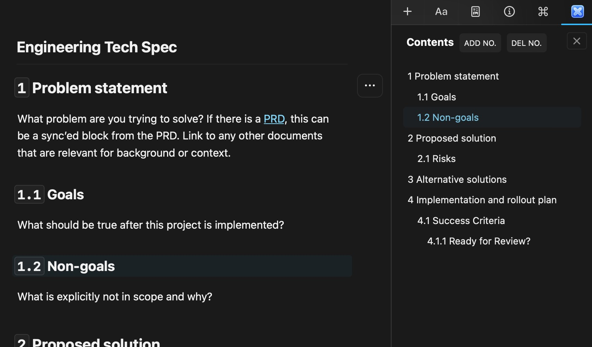

# A craft extension of table of content

## About

Craft does not provide a directory function, so I made a plug-in for the side directory bar. This plugin can instantly generate a 4-level directory according to the document structure, and click the directory item to scroll to the corresponding position.

## Building

Simply run `npm install` and than `npm run build` to generate the .craftX file which can be installed.

You can use `npm run dev` to test and debug in your local environment

## Examples

> Basic usage:

> Auto-Numbering:

> Dark Mode:

